# 双 Token 登录鉴权架构设计图（当前工程版）

> 适用工程：`user-server_node`  
> 设计基线：`Access Token + Refresh Token + Redis 会话状态（sid + hash）`

---

## 1. 架构总览（Context）

该图描述系统参与者与边界：浏览器持有内存 Access Token，Refresh Token 仅在 HttpOnly Cookie 中流转；服务端依赖 Redis 管理可撤销会话状态。

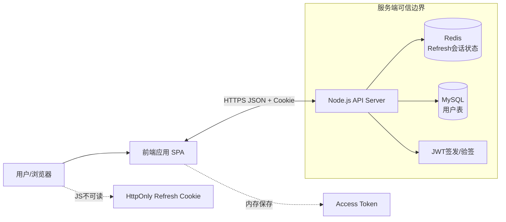

---

## 2. 后端组件关系图（Component）

该图用于理解代码模块职责划分与调用方向。

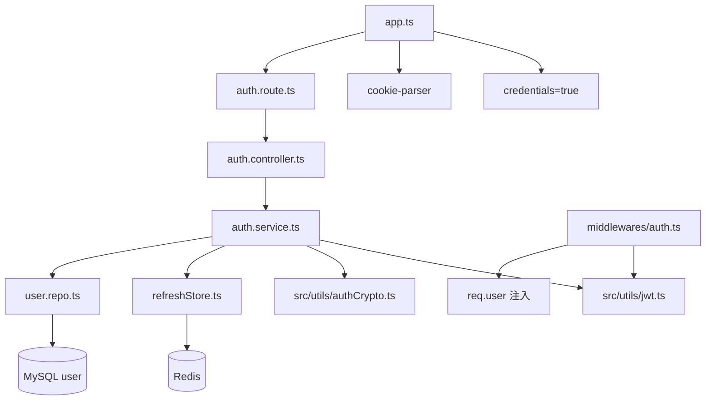

---

## 3. 登录时序图（`POST /api/v1/auth/login`）

说明：
- 输入：`account/password`
- 输出：`accessToken`（响应体）+ `refresh_token`（HttpOnly Cookie）
- Redis：写入 `auth:rt:user:{userId}`，值为 `{sid, hash}` + TTL

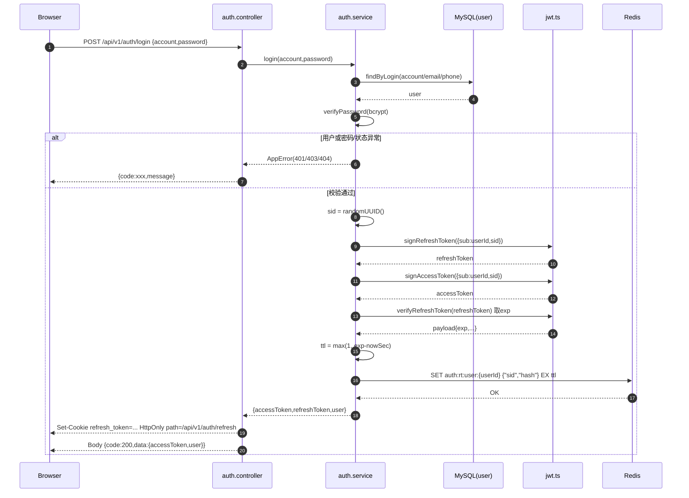

---

## 4. 受保护接口鉴权时序（`Authorization: Bearer <AT>`）

说明：
- 鉴权中间件只接受 `Bearer`
- 仅接受 `type=access` 的 token
- 验签通过后将 `req.user = { userId, sid }`

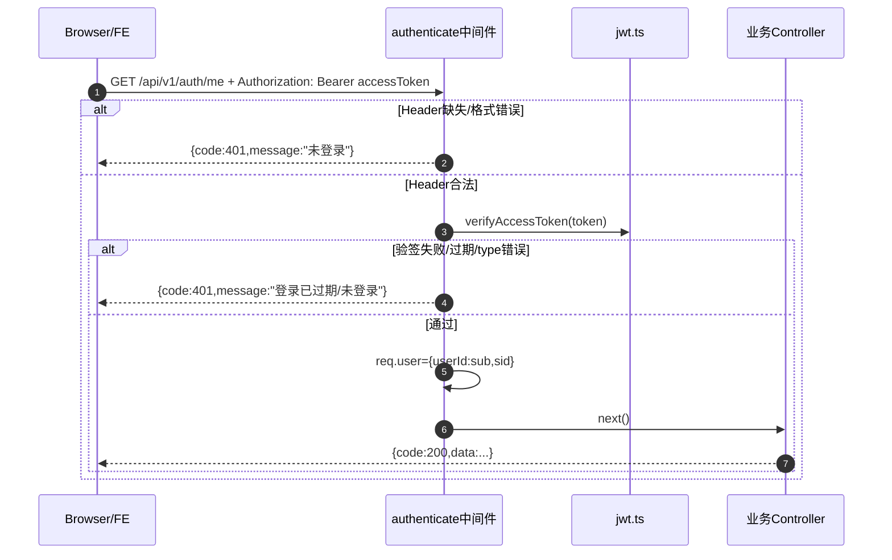

---

## 5. 刷新时序图（`POST /api/v1/auth/refresh`，含旋转）

说明：
- Refresh 优先从 Cookie 读取，Body 仅兜底
- 必须同时通过：JWT 验签 + Redis `sid/hash` 比对
- 成功后旋转：`newRT + newAT`，并覆盖 Redis 中 hash

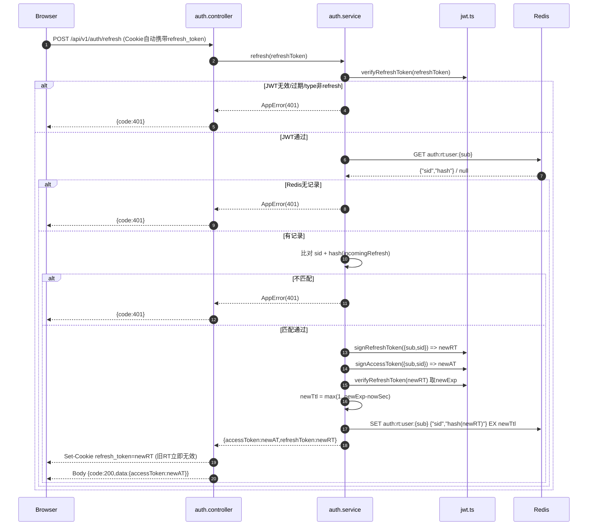

---

## 6. 登出时序图（`POST /api/v1/auth/logout`）

说明：
- 解析 refreshToken 获取 `sub`
- 删除 Redis key 后，清除 Cookie
- 由于 Access Token 是自包含 JWT，若尚未过期仍可能短时间可用（直到 exp）

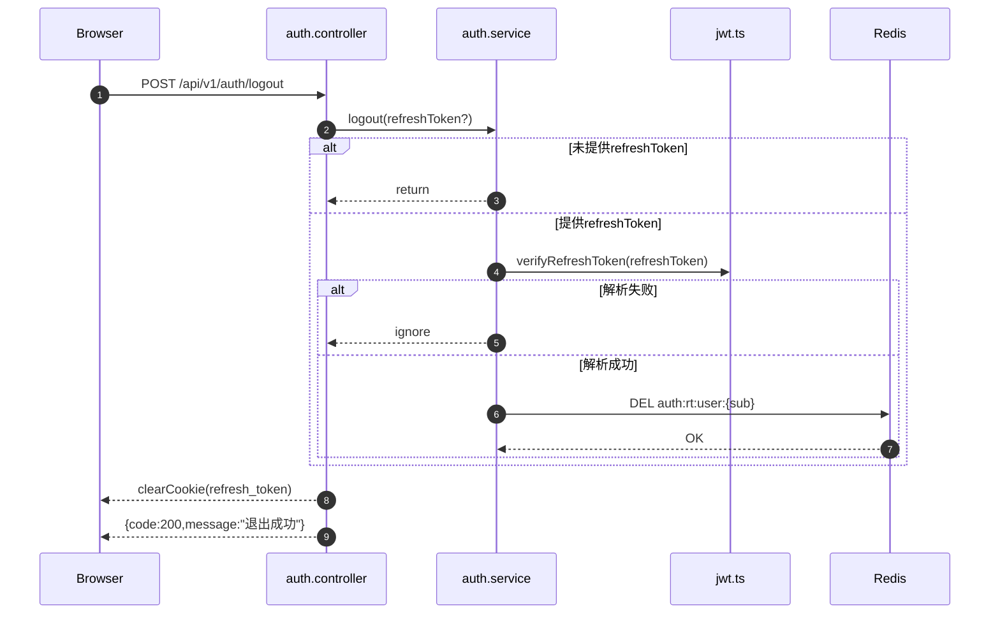

---

## 7. 会话状态机图（State）

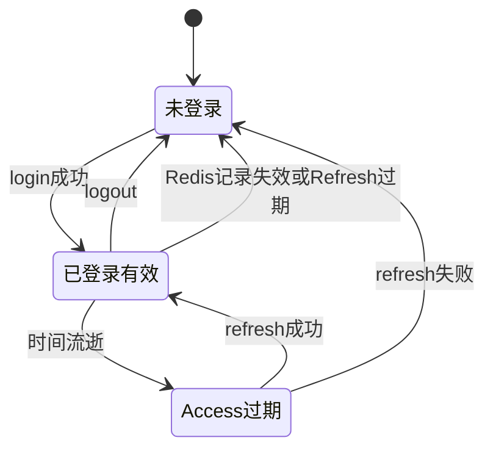

---

## 8. 数据模型图（Token 与 Redis 存储）

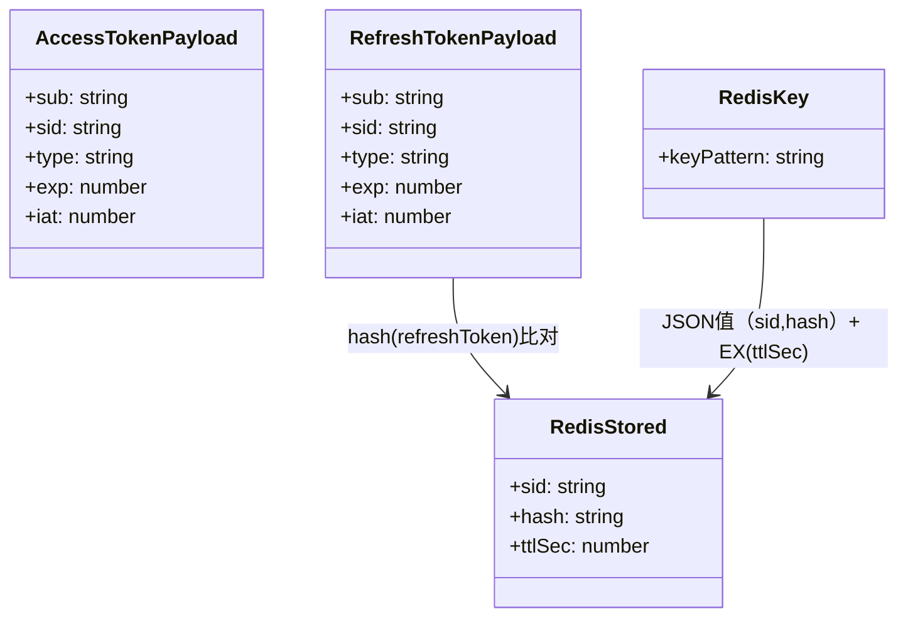

---

## 9. 威胁建模图（STRIDE 简化）

该图用于安全评审，标出主要风险面与当前防护点。

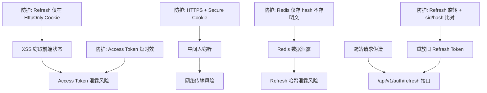

### 安全说明
- `HttpOnly` 降低 JS 读取 Refresh Token 风险，但不能替代输入防护，仍需做 XSS 防护。
- 建议生产环境启用 `COOKIE_SECURE=true`，并仅在 HTTPS 传输。
- 若前后端跨站部署，建议补充 CSRF 策略（如 double-submit token 或 Origin/Referer 校验）。

---

## 10. 并发刷新与单飞（Single-Flight）设计图

问题：多个请求同时 401 时，若每个都去刷新，会造成并发 refresh 冲突和风暴。  
方案：前端只允许一个 refresh 在飞，其余请求等待该 Promise。

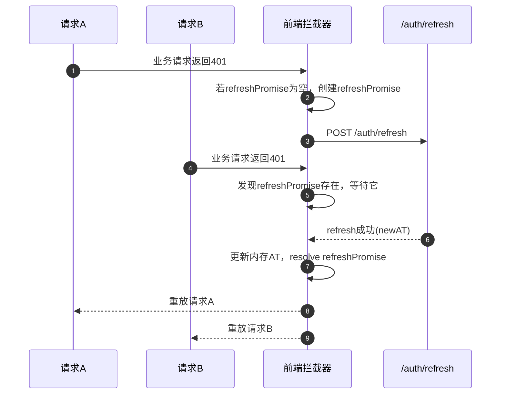

### 前端落地要点
- 全局变量 `refreshPromise: Promise<void> | null`
- 401 时：
  1) 有 `refreshPromise` 就 `await`  
  2) 没有就创建并执行 refresh  
- refresh 失败统一清理登录态并跳转登录页

---

## 11. 调用时序总览（端到端）

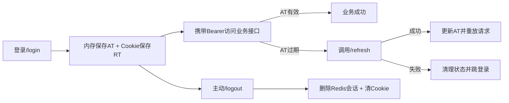

---

## 12. 评审清单（建议）

- 是否所有受保护路由都挂载 `authenticate`。
- 是否确认前端仅内存保存 AT，不持久化到 localStorage。
- 是否开启 `withCredentials`，并与 `CORS origin` 白名单一致。
- 是否在生产强制 HTTPS + `COOKIE_SECURE=true`。
- 是否实现前端单飞 refresh，避免并发刷新风暴。
- 是否定义登录失效后的统一 UX（清状态、跳转、提示）。

